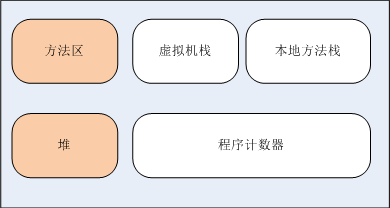
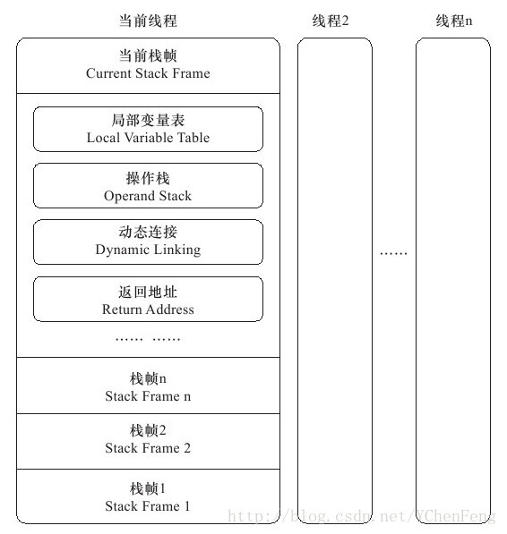

# JVM 虚拟机

Java与C++之间有一堵由内存动态分配和垃圾收集技术所围成的“高墙”，墙外面的人想进去，墙里面的人却想出来。  --《深入理解JAVA虚拟机》

## 参考文章
1. 《深入理解JVM虚拟机》
2. [java内存区域-虚拟机栈](https://blog.csdn.net/ychenfeng/article/details/77247807)
3. [栈帧、局部变量表、操作数栈](https://wangwengcn.iteye.com/blog/1622195)
4. [Java中的字面量](https://www.jianshu.com/p/465073cc94d8)

## 1、运行时数据区域
Java 虚拟机所管理的内存将会包括以下几个运行时数据区域：  

  

* **堆**、**方法区**是**线程共享**的；
* **程序计数器**、**虚拟机栈**、**本地方法栈**是**线程私有**的。

### 1.1、程序计数器
**程序计数器**是一块较小的内存空间，它可以看作是当前线程所执行的字节码的行号指示器。    
由于Java 虚拟机的多线程是通过线程轮流切换并分配处理器执行时间来实现的，在任何一个确定的时刻，一个处理器（对于多核处理器来说是一个内核）
都只会执行一条线程中的指令。  
因此，为了线程切换后能恢复到正确的执行位置，每条线程都需要有一个独立的**程序计数器**，各条线程之间计数器互不影响，独立存储，我们称这类内存区域为**线程私有**的内存。  
* 如果线程正在执行的是一个 Java 方法，这个计数器记录的是正在执行的虚拟机字节码指令的地址；  
* 如果正在执行的是 Native 方法，这个计数器值则为空（Undefined）；
* 此内存区域是唯一一个在Java 虚拟机规范中没有规定任何 OutOfMemoryError 情况的区域。

### 1.2、Java虚拟机栈
Java虚拟机栈是**线程私有**的，它的生命周期与线程相同。  
虚拟机栈描述的是**Java方法**执行的内存模型：每个**方法**在执行的同时都会创建一个**栈帧**用于存储局部变量表、操作数栈、动态链接、方法出口等信息，每一个方法从调用直至执行完成的过程，就对应着一个**栈帧**在虚拟机栈中入栈到出栈的过程。  
**栈帧**的结构如下图所示（细节可看 - **参考文章2**）：  
  
* 局部变量表  
> 局部变量表是一组变量值存储空间，用以存储方法参数与方法内部定义的局部变量。
* 操作数栈
> 操作数栈是一个后入先出的栈，是用来对局部变量表的数据进行计算的栈，它有一部分区域和局部变量表的部分区域重合，方便在方法调用的时候进行数据的传递。  
> 细节可看 - **参考文章3**  
* 动态连接
> 每一个**栈帧**内部都包含一个指向**运行时常量池**的引用来支持当前方法的代码实现**动态链接**。
> 在 Class 文件里面，描述一个方法调用了其他方法，或者访问其成员变量是通过**符号引用**来表示的，**动态链接**的作用就是将这些**符号引用**所表示的方法转换为实际方法的直接引用。
* 方法返回地址
* 附加信息
> 虚拟机规范允许具体的虚拟机实现增加一些规范里没有描述的信息到栈帧之中，例如与调试相关的信息，这部分信息完全取决于具体的虚拟机实现，这里不再详述。  

在实际开发中，一般会把**动态连接**、**方法返回地址**与其他**附加信息**全部归为一类，称为**栈帧信息**。

### 1.3、本地方法栈
本地方法栈与虚拟机栈所发挥的作用是非常相似的，它们之间的区别不过是虚拟机栈为虚拟机执行 Java 方法服务，而本地方法栈则为虚拟机使用到的 Native 方法服务。

### 1.4、Java堆
对于大多数应用来说，Java堆是 Java虚拟机所管理的内存中最大的一块；    
Java堆是所有线程共享的一块内存区域，在虚拟机启动时创建；  
此内存区域的唯一目的就是存放对象实例，几乎所有的对象实例都在这里分配内存。

### 1.5、方法区
方法区与Java堆一样，是各个线程共享的内存区域；  
它用于存储已被虚拟机家在的**类信息**、**常量**、**静态变量**、**即时编译器（JIT）编译后的代码**等数据。

#### 1.5.1 运行时常量池
运行时常量池是方法区的一部分。  
  
Class文件中除了有类的版本、字段、方法、接口等描述信息外，还有一项信息是**常量池**，用于存放**编译期**生成的各种**字面量**和**符号引用**，这部分内容将在类加载后进入方法区的**运行时常量池**中存放。  
  
运行时常量池对于**Class文件常量池**的另外一个重要特征是具备动态性，Java 语言并不要求常量一定只有编译期才能产生，也就是并非预置入 **Class文件中常量池**的内容才能进入方法区的**运行时常量池**，运行期间也可能将新的常量放入池中，这种特性被开发人员利用的比较多的便是String类的intern()方法。  

* 字面量  
char、int、long、float、double、boolean、String、null 对应的具体值都是字面量。
> 细节可看 - **参考文章4**  
> 比如：int i =10;这个10就是字面量。    
> 比如：String str="Hello World";这个"Hello World"就是字面量。  
* 符号引用
> 符号引用就是一个字符串，只要我们在代码中引用了一个非字面量的东西，不管它是变量还是常量，它都是由一个字符串定义的符号，这个字符串存在常量池里，类家在的时候第一次加载到这个符号时，就会将这个**符号引用（字符串）**解析成**直接引用（指针）**。这个解析后的**直接引用**也存储在**运行时常量池**中。
* 直接引用
> 直接引用和虚拟机的布局是相关的，不同的虚拟机对于相同的符号引用所翻译出来的直接引用一般是不同的。如果有了直接引用，那么直接引用的目标一定被加载到了内存中。  
> 直接引用可以是：   
> 1、直接指向目标的指针。（个人理解为：指向对象，类变量和类方法的指针）  
> 2、相对偏移量。（指向实例的变量，方法的指针）  
> 3、一个间接定位到对象的句柄。  

